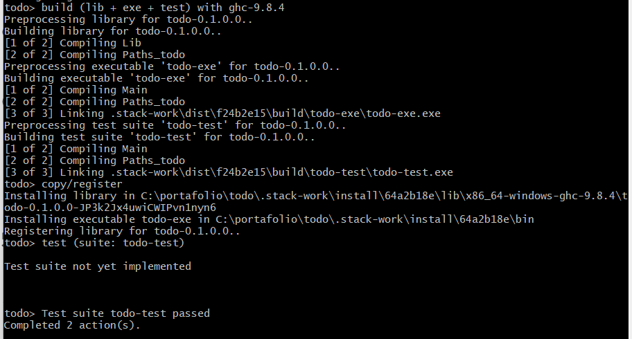

---

title: "Práctica 3"

date: "2025-05-31"

summary: "Esta práctica se enfoca en Haskell, un lenguaje de programación funcional, contrastándolo con Python y C. Explora sus elementos esenciales como el tipado estático, la inmutabilidad y la gestión automática de memoria, y describe la instalación de su entorno, el uso de Stack para crear y probar una aplicación To-Do, y cómo compilarla en un ejecutable local."

---

  

  

# Universidad Autónoma de Baja California

  

## Facultad de Ingeniería, Arquitectura y Diseño

  

  

### Paradigmas de la programación

  

  

### Práctica 3

  

#### *Instalación y funcionamiento de Haskell*

  

  

### Arturo Rafael Cornejo Escobar

  

  

### 31 de abril del 2025

  

  

___

## INTRODUCCIÓN

Haskell es un lenguaje de programación funcional puro, tipificado estáticamente y perezoso, distinto de la mayoría. Recibe su nombre de Haskell Brooks Curry.

**Programación Funcional**
A diferencia de los lenguajes imperativos que ejecutan comandos secuenciales, un programa funcional es una expresión que se evalúa. El enfoque es en qué computar, no en cómo, permitiendo al sistema optimizar el orden de las operaciones.

Esto significa que no se especifica el orden exacto de las operaciones. El sistema determina la mejor secuencia para evaluar las dependencias. La asignación de variables no es tan relevante, ya que el foco está en qué se debe computar, no en cómo.

GHCi significa Glasgow Haskell Compiler interactive.

Es el intérprete interactivo del lenguaje de programación Haskell.

-----

  

  

## DESARROLLO

### Instalación de entorno de desarrollo

En la página oficial de Haskell, nos encontramos con el comando del [instalador](https://www.haskell.org/ghcup/).

```PowerShell
Set-ExecutionPolicy Bypass -Scope Process -Force;[System.Net.ServicePointManager]::SecurityProtocol = 
[System.Net.ServicePointManager]::SecurityProtocol -bor 3072; try { & ([ScriptBlock]::Create((Invoke-WebRequest 
https://www.haskell.org/ghcup/sh/bootstrap-haskell.ps1 -
UseBasicParsing))) -Interactive -DisableCurl } catch { Write-Error $_ }
```

Después de confirmar los directorios de instalación y la instalación de modulos, se abre una ventana de MSY64 que terminará la descarga de los elementos necesarios.

Una vez terminada la instalación, hacemos verificación de esta, con el comando `gch --version` y regresa:

```PowerShell
The Glorious Glasgow Haskell Compilation System, version 9.6.7
```
Se procede a instalar [Docker](https://www.docker.com/products/docker-desktop/) que es una herramienta que te permite **crear, ejecutar y compartir aplicaciones en contenedores**.

Una vez que WSL y Docker Desktop estén configurados, se procede a preparar el entorno para desarrollar en la máquina y compilar dentro de un contenedor.

Obtenemos la imagen de Docker `relaxed_buck.tar` y la montamos ejecutando el comando `docker load -i relaxed_buck.tar`.


Instalamos la extension **Dev Containers** en VScode y se clona el folder `.devcontainer` del repositorio del portafolio, hacemos el primer programa de prueba para comprender como funciona.


---

### Aplicación todo

Con el comando `stack new todo`, creamos un nuevo proyecto desde las plantillas de **stack**.


Comenzaremos con el package.yaml para usar los paquetes de Haskell en su proyecto y agregamos [dotenv](https://hackage.haskell.org/package/dotenv) y el paquete [open-browser](https://hackage.haskell.org/package/open-browser) al proyecto.


Para comprobar que funciona correctamente, se corre una prueba del proyecto con el comando `stack test`.
> Su función es compilar y ejecutar las pruebas (unitarias, integración, etc.) definidas en un proyecto de software escrito en el lenguaje de programación Haskell. 



Compilamos con el comando `stack run`, este es el resultado esperado:


### Estructura del Proyecto
La aplicación se divide en tres archivos fundamentales, cada uno con una función específica:

- app/Main.hs: Es la entrada de la aplicación, manejando la interfaz y de iniciar el bucle de la aplicación.

- src/Lib.hs: Contiene toda la lógica de negocio de la aplicación: cómo se añaden, eliminan, muestran, editan y listan las tareas pendientes.

- test/Spec.hs: Contiene las pruebas unitarias para verificar que las funciones de la lógica funcionan correctamente.

**Main.hs**

```Haskell
module Main where

import Lib (prompt)

main :: IO ()
main = do    
    putStrLn "Commands:"
    putStrLn "+ <String> - Add a TODO entry"
    putStrLn "- <Int>    - Delete the numbered entry"
    putStrLn "s <Int>    - Show the numbered entry"
    putStrLn "e <Int>    - Edit the numbered entry"
    putStrLn "l          - List todo"
    putStrLn "r          - Reverse todo"
    putStrLn "c          - Clear todo"
    putStrLn "q          - Quit"
    prompt [] -- Start with the empty todo list.
```

**Lib.hs**

```Haskell

module Lib
  ( prompt,
    editIndex,
  )
where

import Data.List

-- import Data.Char (digitToInt)

putTodo :: (Int, String) -> IO ()
putTodo (n, todo) = putStrLn (show n ++ ": " ++ todo)

prompt :: [String] -> IO ()
prompt todos = do
  putStrLn ""
  putStrLn "Test todo with Haskell. You can use +(create), -(delete), s(show), e(dit), l(ist), r(everse), c(lear), q(uit) commands."
  command <- getLine
  if "e" `isPrefixOf` command
    then do
      print "What is the new todo for that?"
      newTodo <- getLine
      editTodo command todos newTodo
    else interpret command todos

interpret :: String -> [String] -> IO ()
interpret ('+' : ' ' : todo) todos = prompt (todo : todos) -- append todo to the empty or previous todo list [] here.
interpret ('-' : ' ' : num) todos =
  case deleteOne (read num) todos of
    Nothing -> do
      putStrLn "No TODO entry matches the given number"
      prompt todos
    Just todos' -> prompt todos'
interpret ('s' : ' ' : num) todos =
  case showOne (read num) todos of
    Nothing -> do
      putStrLn "No TODO entry matches the given number"
      prompt todos
    Just todo -> do
      print $ num ++ ". " ++ todo
      prompt todos
interpret "l" todos = do
  let numberOfTodos = length todos
  putStrLn ""
  print $ show numberOfTodos ++ " in total"

  mapM_ putTodo (zip [0 ..] todos)
  prompt todos
interpret "r" todos = do
  let numberOfTodos = length todos
  putStrLn ""
  print $ show numberOfTodos ++ " in total"

  let reversedTodos = reverseTodos todos

  mapM_ putTodo (zip [0 ..] reversedTodos)
  prompt todos
interpret "c" todos = do
  print "Clear todo list."

  prompt []
interpret "q" todos = return ()
interpret command todos = do
  putStrLn ("Invalid command: `" ++ command ++ "`")
  prompt todos

-- Move the functions below to another file.

deleteOne :: Int -> [a] -> Maybe [a]
deleteOne 0 (_ : as) = Just as
deleteOne n (a : as) = do
  as' <- deleteOne (n - 1) as
  return (a : as')
deleteOne _ [] = Nothing

showOne :: Int -> [a] -> Maybe a
showOne n todos =
  if (n < 0) || (n > length todos)
    then Nothing
    else Just (todos !! n)

editIndex :: Int -> a -> [a] -> [a]
editIndex i x xs = take i xs ++ [x] ++ drop (i + 1) xs

editTodo :: String -> [String] -> String -> IO ()
editTodo ('e' : ' ' : num) todos newTodo =
  case editOne (read num) todos newTodo of
    Nothing -> do
      putStrLn "No TODO entry matches the given number"
      prompt todos
    Just todo -> do
      putStrLn ""

      print $ "Old todo is " ++ todo
      print $ "New todo is " ++ newTodo
      -- let index = head (map digitToInt num)
      -- let index = read num::Int
      -- print index

      let newTodos = editIndex (read num :: Int) newTodo todos -- Couldn't match expected type ‘Int’ with actual type ‘[Char]
      let numberOfTodos = length newTodos
      putStrLn ""
      print $ show numberOfTodos ++ " in total"
      mapM_ putTodo (zip [0 ..] newTodos)

      prompt newTodos

editOne :: Int -> [a] -> String -> Maybe a
editOne n todos newTodo =
  if (n < 0) || (n > length todos)
    then Nothing
    else do
      Just (todos !! n)

reverseTodos :: [a] -> [a]
reverseTodos xs = go xs []
  where
    go :: [a] -> [a] -> [a]
    go [] ys = ys
    go (x : xs) ys = go xs (x : ys) 
```

Contiene la lógica central de la aplicación To-Do en Haskell. Define la función prompt, que es el bucle interactivo para procesar los comandos del usuario (+, -, l, etc.), y todas las funciones auxiliares para manipular la lista de tareas (añadir, borrar, editar, mostrar, invertir). Usa pattern matching, recursión y el tipo Maybe para gestionar las operaciones y posibles errores.

Una vez con la logica y la interfaz, se procede a probar las funciones iniciando con el comando `stack repl`:

Cuando es ejecutado en el directorio raiz del proyecto, stack repl hace algunas cosas antes de iniciar GHCi:
- Resuelve y descarga dependencias.
- Compila el proyecto.
- Carga los módulos de tu proyecto: Una vez que GHCi se inicia, automáticamente carga todos los módulos (`Lib.hs`) del proyecto. 


Probamos las funciones en el GHCi:


Ya que vemos que esta lista para ser usada, probamos con `stack run` y se muestra esto:


Probaremos las funciones:


**Specs.hs**

```Haskell
import Control.Exception 

import Lib (editIndex)

main :: IO ()
main = do
    putStrLn "Test:"
    let index = 1
    let new_todo = "two"
    let todos = ["Write", "a", "blog", "post"]
    let new_todos = ["Write", "two", "blog", "post"]

    let result = editIndex index new_todo todos == new_todos

    -- assert :: Bool -> a -> a
    putStrLn $ assert result "editIndex worked." 
```

Esta es una prueba unitaria para ver si la aplicación esta funcionando con el comando `stack test`.

.

### Crear y usar un ejecutable de la app Todo

Este proceso te permite convertir tu proyecto Haskell en un programa independiente que puedes ejecutar directamente desde tu terminal, sin necesidad de stack run o GHCi.

El comando `stack install --local-bin-path .` compila la aplicación y la convierte en un archivo ejecutable directamente en la carpeta del proyecto.

Ya con el ejecutable creado, se puede ejecutar directamente desde la terminal.

.

Se puede hacer un comando global con las siguientes instrucciones: `mv todo-exe todo` y `mv todo /usr/local/bin`. Así se podra hacer uso de la aplicación Haskell **todo** con solo un comando `todo`.

---

**Referencias**

Steadylearner. (2023, 23 junio). **How to use Haskell to build a todo app with Stack**. *DEV Community*. https://dev.to/steadylearner/how-to-use-stack-to-build-a-haskell-app-499j?authuser=0
 

---

**Dirección del repositorio:**

https://github.com/roixarturo/portafolio1

  

**Dirección de la página de GitHub:**

https://roixarturo.github.io/portafolio1/
