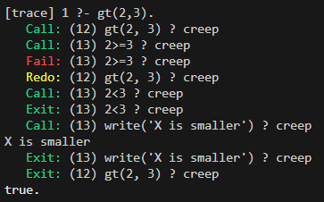
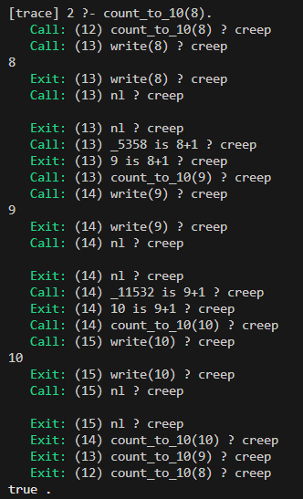

---

title: "Práctica 4"

date: "2025-05-31"

summary: "Este informe presenta los conceptos básicos de Prolog, un lenguaje lógico orientado al razonamiento simbólico y se detalla el proceso de instalación de SWI-Prolog y el uso del intérprete con herramientas como trace. para depuración. Se probaron varios archivos (operadores.pl, option.pl, loop.pl, etc.) abordando estructuras como control de flujo, listas, bucles, conjunciones y disyunciones."

---

  

  

# Universidad Autónoma de Baja California

  

## Facultad de Ingeniería, Arquitectura y Diseño

  

  

### Paradigmas de la programación

  

  

### Práctica 4

  

#### *Desarrollo e introducción a Prolog*

  

  

### Arturo Rafael Cornejo Escobar

  

  

### 31 de abril del 2025

  

  

___

## INTRODUCCIÓN

### ¿Qué es la Programación Prolog?

A diferencia de los lenguajes tradicionales que se centran en la resolución de problemas paso a paso, la programación **Prolog** se basa en la **lógica y el razonamiento**. Los problemas se enuncian de forma declarativa, y el intérprete se encarga del proceso de solución. Esto lo hace especialmente potente para tareas que implican **razonamiento simbólico, representación del conocimiento e inteligencia artificial**.

**Prolog** es uno de los lenguajes de programación lógica más populares, desarrollado en la década de 1970. Aunque su uso en la IA convencional ha disminuido, sigue siendo valioso en áreas específicas como los **sistemas expertos** y el **procesamiento del lenguaje natural**. Su objetivo inicial era construir sistemas inteligentes capaces de razonar y resolver problemas como los humanos.

### Conceptos Fundamentales de Prolog

La programación en Prolog  se basa en cuatro pilares:

-   **Hechos**: Son afirmaciones que se asumen como verdaderas y representan los bloques de construcción básicos del conocimiento. Son similares a oraciones simples en el lenguaje natural.
    -   Ejemplo: `Padre(Juan, María).`
-   **Reglas**: Expresan relaciones entre los hechos y permiten el razonamiento y la deducción. Constan de una cabeza (la conclusión) y un cuerpo (las condiciones).
    -   Ejemplo: `mortal(X) :- humano(X).` ( Si X es humano, entonces X es mortal)
-   **Variables**: Son marcadores de posición para valores desconocidos en hechos y reglas. Facilitan la unificación, un proceso de coincidencia de variables con valores específicos.
    -   Ejemplo: `le_gusta(X, música) :- género(X, Pop).` ( Regla: A alguien le gusta la música si su género es Pop)
-   **Consultas**: Se utilizan para pedirle al intérprete que resuelva problemas basándose en las reglas y hechos del programa.
    -   Ejemplo: `?- Padre(Juan, X).`

-----

  

  

## DESARROLLO
  

### Instalación del entorno de desarrollo 

Para instalar prolog, lo haremos desde la página de [SWI prolog](https://www.swi-prolog.org/download/devel/bin/swipl-9.3.24-1.x64.exe.envelope), durante la instalación, marcaremos la opción para designar el PATH en el usuario actual.

Verificamos esto con el comando `swipl` en bash.

### Consulta

Lo primero es dar el comando de `trace.`, ya qué nos ayudara a seguir todas las llamadas del programa.

Consultaremos primero, el archivo de los **operadores de datos** (operadores.pl).

 

- `calc`.: Este es el predicado (la función o regla) que el intérprete está a punto de ejecutar.
- `?`: Este signo de interrogación indica que el depurador está esperando una acción tuya. Te está preguntando qué quieres hacer a continuación con la ejecución de calc.
- `creep`: Significa "avanzar paso a paso". Le estás diciendo al depurador que continúe ejecutando el código línea por línea (o subobjetivo por subobjetivo), y que se detenga y te pregunte de nuevo en el siguiente puerto de traza. Es el modo más granular de depuración.

Ahora, seguiremos con los **controles de flujos** (option.pl)

**Bucles** (loop.pl)

- Contador a 10

- Rangos

**Conjunciones y disyunciones** (conj_disj.pl)

**Listas** (_basic.pl, _misc.pl, _repost.pl)
- list_basic.pl

- list_misc.pl

---
**Referencias**

United States Artificial Intelligence Institute (USAII®). (s. f.). What is Prolog Programming Language: An Overview. https://www.usaii.org/ai-insights/what-is-prolog-programming-language-an-overview. 

---

**Dirección del repositorio:**

https://github.com/roixarturo/portafolio1

  

**Dirección de la página de GitHub:**

https://roixarturo.github.io/portafolio1/

